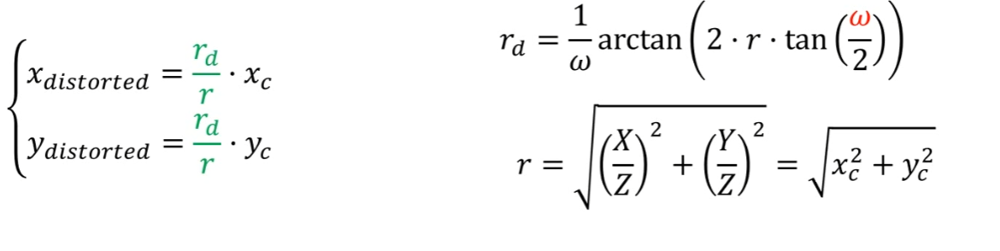
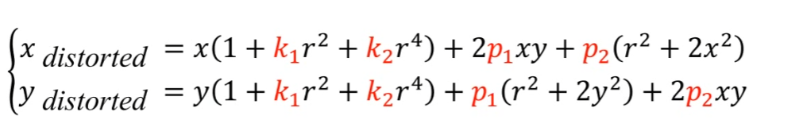
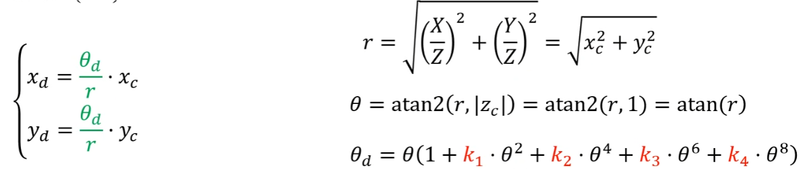
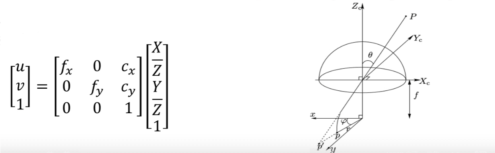
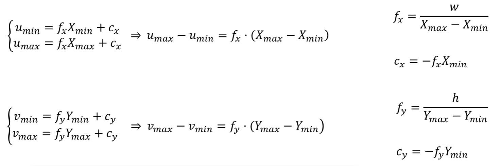

- # DSO原理与代码解析

## 预备知识：

### 1、Direct&Spase

- **Direct：**没有预处理，直接将传感器的值作为测量

- **Indirect**：如ORB2，第一步建立数据关联，得到中间值，包括特征点、线和曲线段提取特征匹配，稠密光流等。第二步把数据作为测量，进行状态估计

- **Sparse：**重建出一些独立的像素点

- **Dense：**重建出所有的像素点

- **本质差别在于是否有几何先验**，几何先验（Geometric Priors）是指在处理几何问题时，预先已知或假设的一些几何特性或约束。

## 2、几何和光度模型

#### DSO中的畸变模型

- **FOV**：即视场角，FOV又分为HFOV(水平)、VFOV(VFOV)、DFOV(对角)

- **RadTan:**

- **Equidistant(KB)**:

  

- **Pinhole**:

#### 去畸变后的新内参

**思想**：将校正后的图像加畸变，变化到原图，保证都能落到原图上

- 将单位平面的坐标映射到原图像（畸变），求单位平面的范围Xmin， Xmax,

